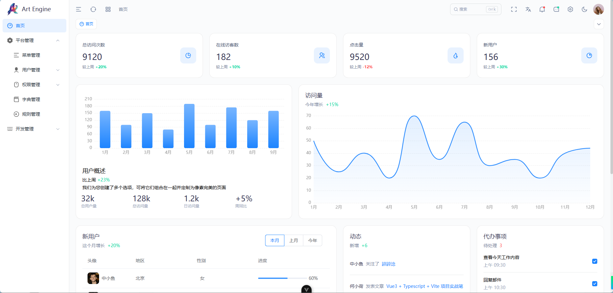
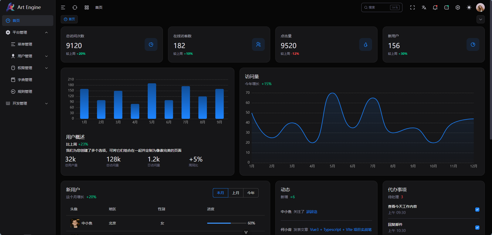

<br />
<p align="left">一款兼具设计美学与高效开发的后台管理系统，助你快速构建专业级应用</p>

<div align="left">
<p>
  <a href="https://gitee.com/hiroshi-xh/art-engine/stargazers">
    
  </a>
  <a href="https://gitee.com/hiroshi-xh/art-engine/members">
    
  </a>
</p>
</div>

## 这个项目有什么特别的呢？

**界面设计**：现代化 UI 设计，流畅交互，以用户体验与视觉设计为核心

**极速上手**：简洁架构 + 完整文档，后端开发者也能轻松使用

**丰富组件**：内置数据展示、表单等多种高质量组件，满足不同业务场景的需求

**丝滑交互**：按钮点击、主题切换、页面过渡、图表动画，体验媲美商业产品

**高效开发**：内置 useTable、ArtForm 等实用 API，显著提升开发效率

## 技术栈

开发框架：Vue3、TypeScript、Vite、Element-Plus、Tailwind CSS

代码规范：Eslint、Prettier、Stylelint、Husky、Lint-staged、cz-git

## 预览

<kbd></kbd>

<kbd></kbd>

## 安装运行

```bash
# 安装依赖
pnpm install

# 如果 pnpm install 安装失败，尝试使用下面的命令安装依赖
pnpm install --ignore-scripts

# 本地开发环境启动
pnpm dev

# 生产环境打包
pnpm build
```

## 兼容性

支持 Chrome、Safari、Firefox 等现代主流浏览器。

## 贡献

我们真诚欢迎并感谢每一位贡献者的支持！无论您有新想法、功能建议还是代码优化，都可以通过以下方式参与：

提交 Pull Request：分享您的代码，助力项目成长。

创建 GitHub Issue：提出 bug 反馈或新功能建议，让我们一起完善。

您的每一点贡献都让这个项目更进一步！快来加入我们的开源社区吧！

## 持续优化与扩展

项目保持活跃更新，支持最新前端技术栈，兼容主流框架，确保长期稳定性和扩展性。社区驱动的反馈机制，让你的需求快速融入项目迭代。
